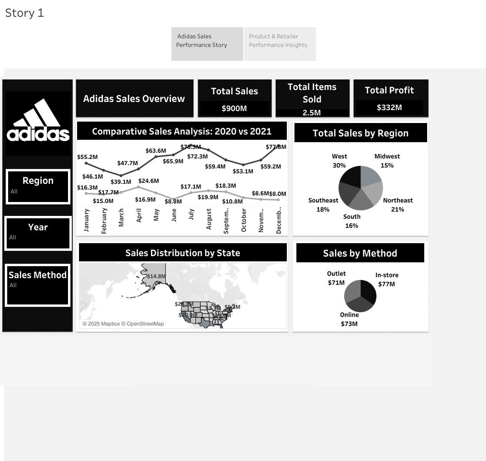

Adidas Sales Analysis Dashboard

This is my first real project using Tableau, completed as part of the ITI Power BI Track.

Project Objective
Analyze Adidas sales data over two years to gain insights into:
- Product performance
- Regional sales trends
- Retailer impact
- Sales methods efficiency

 🔍 Key Insights
- 📈Sales in 2021 increased significantly compared to 2020.
- 👟 Men’s Street Footwear was the top-selling product.
- 🌍 West Region achieved the highest sales.
- 🛒 Most sales occurred In-Store.

 📌 Dashboards Created
 1. Adidas Sales Overview
Includes:
- KPIs (Total Sales, Units Sold, Profit)
- Year-over-Year Comparative Sales
- Sales by Region
- Sales by Methods
- Sales by State Distribution

 2. Product & Retailer Performance
Includes:
- Sales by Product Category
- Sales by Retailer
- Profit Margin by Product & Region

🛠 Tools Used
- Tableau
- Excel (for data cleaning and formatting)

📷 Dashboard Snapshots

